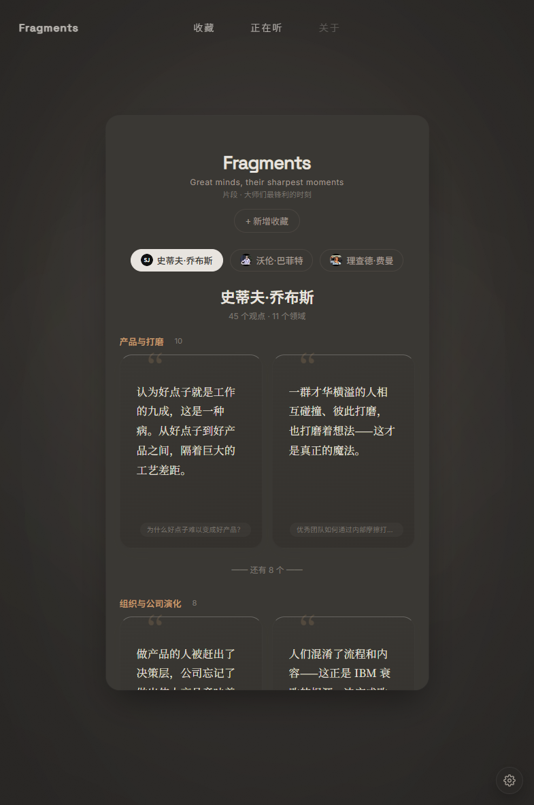

# Fragments

> **Great minds, their sharpest moments.**  
> 片段 · 大师们最锋利的时刻



我们经常在刷视频时被乔布斯、芒格、马斯克、巴菲特的精彩片段激励和鼓舞，想保存下来、以后反复听。Fragments 把这些精选片段按领域结构化地组织起来，让你随时取用。

**Fragments** 是一个从名人演讲与访谈中，切分出关于产品、商业、组织、个人成长等领域接近本质的思考片段的音频产品。

---

## 核心特点

- **真人原话** — 永远是某个真人在某个真实场合说过的原话，绝不让 AI 拼凑、模仿或总结
- **按领域切片** — 自动切分为「产品与打磨」「组织与公司演化」「决策与判断」等领域，结构化浏览
- **可溯源** — 所有片段均可追溯到具体视频和时间戳
- **暗色/暖色双主题** — 默认暗色模式，沉浸收听

---

## 技术栈

- **前端：** Vite + React + TypeScript
- **转录与切片：** Python pipeline（Gemini + sentence-transformers）
- **音频源：** YouTube IFrame Player API

---

## 本地运行

```bash
npm install
npm run dev
```

数据 pipeline 见 `scripts/` 目录，需要 Python 环境及 `GEMINI_API_KEY`。
